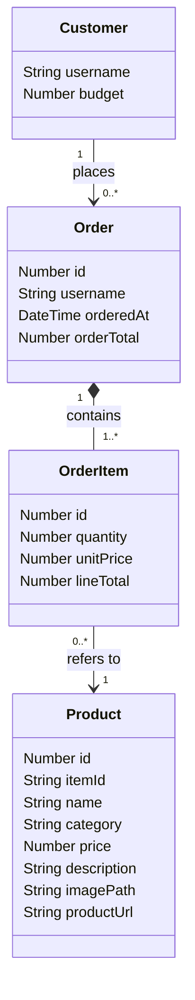

# Architecture — Furniture Shop Buyer App

How the app is built, and what's still ahead to reach the full sleek, photo-led catalogue
and cart described in `requirements.md`.

## Previous version (R + Shiny, removed)

Day 1 started as an R + Shiny app: one language for UI and logic, SQLite via `DBI`/
`RSQLite`, `shinymanager` for login. It was a complete, tested app — login, single-product
ordering, budget enforcement, order history — but was replaced partway through Day 1: a
real photo card grid, hover states, and a snappy multi-select cart meant writing raw
HTML/CSS against Shiny's reactive component model rather than with it. See
`requirements.md` for the full reasoning.

The R version has been removed from the working tree. It's recoverable from git history
(`git log`, then `git checkout <commit> -- app.R R/ tests/`) if ever needed for reference —
its budget-enforcement logic (`can_afford()`) in particular is a direct model for the
Python equivalent described below, once that's built.

## Stack

- **Flask** — Python micro web framework: routes, request handling, sessions.
- **Jinja2** (bundled with Flask) — server-rendered HTML templates.
- **SQLite**, via Python's built-in `sqlite3` — file-based database, no server to install
  or run. Now used only as a local image cache and for the legacy budget-logic tests (see
  below) — it's no longer the source of truth for catalogue data, orders, or balance.
- **requests** — HTTP client `furniture_api.py` uses to call the event's real
  furniture-shop REST API: catalogue search, balance, place order, order history. This is
  now the source of truth for everything except product photos.
- **Flask-Login** + `werkzeug.security` (bundled with Flask) — session-based login and
  password hashing. Local demo accounts only; unrelated to the real API account (see
  Built so far, below).
- Hand-written CSS (`static/style.css`) for the card grid and overall look — no CSS/JS
  framework.
- **pymongo** + **python-dotenv** — `sync_catalogue.py` uses `pymongo` to decode product
  photos from the shared training MongoDB instance into `static/images/`, keyed by
  `item_id`; the running app matches these onto the live API's products by that same id.
  `python-dotenv` loads `.env` for both that script and `furniture_api.py`.

## File structure

```text
app.py                       # entry point — Flask app, routes
furniture_api.py             # client for the event's real REST API — catalogue, balance, orders
db.py                        # local SQLite: image-path lookup + legacy budget-logic tests
auth.py                      # Flask-Login setup, password hashing, demo user accounts
sync_catalogue.py            # decodes product photos from the shared MongoDB catalogue into static/images/
.env                          # FURNITURE_API_BASE_URL/USER_ID/KEY, MONGODB_URI (gitignored; see .env.example)
templates/
├── base.html                 # shared layout: nav, flash messages
├── login.html
├── catalogue.html            # home page — live product grid, photos matched in by item_id
└── orders.html               # "My Orders" page — from furniture_api.get_orders()
static/
├── style.css                 # card grid, hover states, colour palette
└── images/                   # product photos decoded by sync_catalogue.py (gitignored)
data/
├── flask_shop.sqlite         # image-path cache + legacy products/orders tables (gitignored)
└── flask_credentials.sqlite  # login credentials (gitignored, regenerated on first run)
```

One file per responsibility, same shape the R version used.

## Data model



Four things the app needs to remember, in plain English:

- **Customer** — a logged-in buyer: their username and their budget ceiling. Their password
  isn't shown here — that's handled by Flask-Login and a separate credentials database.
- **Product** — one catalogue item: name, category, price, description, and a photo. The
  `itemId` and `productUrl` fields are the source catalogue's own product code and a link
  back to its original listing — carried through as-is rather than invented.
- **Order** — one submitted "shopping trip": who placed it, when, and its total.
- **OrderItem** — one product within an order, and how many of it — e.g. "2 × Lund Dining
  Chair" on a particular order. One Order can have several OrderItems, each pointing at a
  different Product — this is what makes multi-product orders possible once they're built
  (see Still ahead, below; today each order only ever has one OrderItem).

**This model describes `db.py`'s local tables, which the running app no longer persists
to for orders or catalogue data (see Built so far, below) — real Customers/Orders/OrderItems
now live in the event's API, not in this database.** The model still stands as the shape
`tests/test_budget.py` exercises, and as the reference for the local image-path cache
(`Product.itemId`/`imagePath`), but it isn't the live app's runtime state any more.

How they connect:

- A **Customer places** any number of **Orders** over time — that's their order history.
- An **Order contains** one or more **OrderItems**. An order can't be empty, and an item
  can't exist without its order (shown as the filled diamond).
- Each **OrderItem refers to** exactly one **Product**, but keeps its own `quantity` and
  `unitPrice` rather than looking the price up fresh each time — so a later catalogue price
  change can't silently rewrite the value of a past order.

**Deliberately not modelled: a cart.** Nothing today holds an in-progress, multi-item
selection — "Add to order" places a complete one-item Order immediately. A real cart would
live in the Flask session (a signed cookie holding `{product_id: quantity}`) until
submitted, at which point it becomes an Order plus its OrderItems, same as today. If it's
later decided carts should survive a logout, the cart would need to persist server-side
instead, and it would become a fifth entity.

## Built so far

- Login: Flask-Login + `werkzeug` password hashing, three demo users seeded on first run.
  These are local-only accounts — they gate access to the app, but every one of them acts
  as the *same* real account against the event API (see below), because that API is keyed
  to one `FURNITURE_API_KEY`, not to whichever demo user is logged in.
- **Live catalogue**: `furniture_api.get_catalogue()` paginates
  `GET /catalogue/search-index` (name, category, price — fast, no images; the plain
  `/catalogue` endpoint embeds every image as base64 and is much slower, per the event's
  own API guide) and returns all 762 real IKEA products. `app.py` groups them into
  category sections with `itertools.groupby`, same as before, just over live API data
  instead of a local table.
- **Category filter tabs**: `GET /?category=<name>` now filters the live API result in
  Python rather than in a `WHERE` clause, since the API itself only filters by exact
  category match, not the counts the tab bar needs. The "All" tab is `GET /` with no
  param; the tab bar always lists every category with its count, independent of which one
  is currently selected.
- **Product photos**: the search-index endpoint never returns images, so they're sourced
  separately — `sync_catalogue.py` connects to the shared, read-only training MongoDB
  instance (`MONGODB_URI` in `.env`), decodes each product's `image_url` field (misleadingly
  named — it's the image's raw base64 bytes, not a URL) into a file under
  `static/images/{item_id}.{ext}`, and `db.get_image_paths()` maps `item_id → path` for
  `app.py` to attach onto each live API product by that same id. That shared Mongo cluster
  currently has no primary (secondaries only) — `sync_catalogue.py` connects with
  `read_preference=SECONDARY_PREFERRED`, or the default read preference fails outright even
  though the data's reachable. Re-run `sync_catalogue.py` any time to refresh photos; it no
  longer touches product name/price/category (those are always live from the API), so a
  stale image cache can't disagree with the live catalogue on anything but the photo.
- "Add to order": one click calls `furniture_api.place_order()`, which really debits the
  event's balance for this API account and returns a message straight from the API
  (success, `402` insufficient balance, `404` unknown item, `429` rate-limited).
- "My Orders": `furniture_api.get_orders()` — the real account's own order history from the
  API, most recent first.
- **Remaining-budget display**: a Flask `context_processor` calls
  `furniture_api.get_balance()` on every request and exposes `remaining_budget` to every
  template. There's no local `spent` calculation any more — the balance already reflects
  every order placed through the API, including ones made outside this app.
- **Budget enforcement**: happens API-side now, not in this app. A `POST /orders` that would
  exceed the balance gets a `402`, which `furniture_api.place_order()` turns into
  `{"success": False, "message": "Insufficient balance: ..."}` for `/buy` to flash back.
  `db.can_afford()`/`db.place_order()` still exist as a local, pure-function model of the
  same rule (`spent + order_total <= budget`), but only `tests/test_budget.py` exercises
  them now — the running app doesn't call them.
- **Tests**: `tests/test_budget.py`, `pytest`, unchanged — still a unit test of the budget
  rule in isolation (`db.can_afford`/`db.place_order` against a local SQLite table), not an
  end-to-end test of the real API's own enforcement. Same cases as the original R
  `testthat` suite: `can_afford` at the exact boundary and just over it; `place_order`
  succeeds and updates spend; over-budget is refused and not recorded; unknown product is
  rejected.

## Public access (ngrok)

- `GET /health` — a plain, unauthenticated `200 ok`. Exists specifically so a tunnelling
  or monitoring tool has something reachable to check before anyone trusts the tunnel;
  not part of the buyer flow itself.
- The running `python app.py` process is exposed with `ngrok http 5000`. Ngrok is
  authenticated with a personal authtoken (`ngrok config add-authtoken ...`), stored in
  ngrok's own config file (`%LOCALAPPDATA%\ngrok\ngrok.yml`) — never in this repo.
- The resulting `https://*.ngrok-free.dev` URL is not a deployment: it's a tunnel to this
  one local process. It goes dead the moment either `python app.py` or the `ngrok`
  process stops, and a fresh run of `ngrok http 5000` gets a new random URL.

## Still ahead

- **Multi-select cart** — a session cart, a review/checkout page, and a `place_cart_order()`
  that writes one `orders` row plus several `order_items` rows in a single transaction.
  Today's "Add to order" is instant and single-item; there's no cart to review first. Once
  a quantity selector exists, `place_order`/`can_afford` will need an invalid-quantity check
  and test, matching the R version's.

## Risks / things to know

- Multi-image or zoom galleries are explicitly out of scope in `requirements.md` — one
  photo per product keeps the image-sourcing problem manageable.
- Without a JS interactivity layer, every action (add to order, in future: cart changes)
  is a normal full-page reload — functional, but not as snappy as a single-page app would
  feel. A small `static/cart.js` using `fetch()` would recover that, as an enhancement on
  top of a working server-rendered flow, once there's a cart to make snappy.
