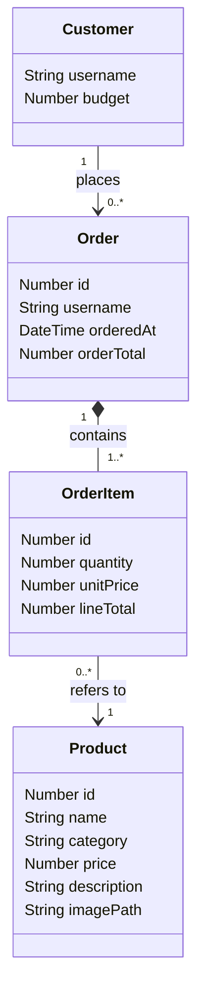

# Architecture — Furniture Shop Buyer App

How the app is built, and what's still ahead to reach the full sleek, photo-led catalogue
and cart described in `requirements.md`.

## Previous version (R + Shiny, removed)

Day 1 started as an R + Shiny app: one language for UI and logic, SQLite via `DBI`/
`RSQLite`, `shinymanager` for login. It was a complete, tested app — login, single-product
ordering, budget enforcement, order history — but was replaced partway through Day 1: a
real photo card grid, hover states, and a snappy multi-select cart meant writing raw
HTML/CSS against Shiny's reactive component model rather than with it. See
`requirements.md` for the full reasoning.

The R version has been removed from the working tree. It's recoverable from git history
(`git log`, then `git checkout <commit> -- app.R R/ tests/`) if ever needed for reference —
its budget-enforcement logic (`can_afford()`) in particular is a direct model for the
Python equivalent described below, once that's built.

## Stack

- **Flask** — Python micro web framework: routes, request handling, sessions.
- **Jinja2** (bundled with Flask) — server-rendered HTML templates.
- **SQLite**, via Python's built-in `sqlite3` — file-based database, no server to install
  or run.
- **Flask-Login** + `werkzeug.security` (bundled with Flask) — session-based login and
  password hashing. The shop-data/credentials database split carries over from the
  original design.
- Hand-written CSS (`static/style.css`) for the card grid and overall look — no CSS/JS
  framework.

## File structure

```text
app.py                       # entry point — Flask app, routes
db.py                        # SQLite access: products, orders, order_items
auth.py                      # Flask-Login setup, password hashing, demo user accounts
templates/
├── base.html                 # shared layout: nav, flash messages
├── login.html
├── catalogue.html            # home page — product card grid
└── orders.html               # "My Orders" page
static/
└── style.css                 # card grid, hover states, colour palette
data/
├── flask_shop.sqlite         # products + orders (gitignored, regenerated on first run)
└── flask_credentials.sqlite  # login credentials (gitignored, regenerated on first run)
```

One file per responsibility, same shape the R version used.

## Data model



Four things the app needs to remember, in plain English:

- **Customer** — a logged-in buyer: their username and their budget ceiling. Their password
  isn't shown here — that's handled by Flask-Login and a separate credentials database.
- **Product** — one catalogue item: name, category, price, description, and a photo.
- **Order** — one submitted "shopping trip": who placed it, when, and its total.
- **OrderItem** — one product within an order, and how many of it — e.g. "2 × Lund Dining
  Chair" on a particular order. One Order can have several OrderItems, each pointing at a
  different Product — this is what makes multi-product orders possible once they're built
  (see Still ahead, below; today each order only ever has one OrderItem).

How they connect:

- A **Customer places** any number of **Orders** over time — that's their order history.
- An **Order contains** one or more **OrderItems**. An order can't be empty, and an item
  can't exist without its order (shown as the filled diamond).
- Each **OrderItem refers to** exactly one **Product**, but keeps its own `quantity` and
  `unitPrice` rather than looking the price up fresh each time — so a later catalogue price
  change can't silently rewrite the value of a past order.

**Deliberately not modelled: a cart.** Nothing today holds an in-progress, multi-item
selection — "Add to order" places a complete one-item Order immediately. A real cart would
live in the Flask session (a signed cookie holding `{product_id: quantity}`) until
submitted, at which point it becomes an Order plus its OrderItems, same as today. If it's
later decided carts should survive a logout, the cart would need to persist server-side
instead, and it would become a fifth entity.

## Built so far

- Login: Flask-Login + `werkzeug` password hashing, three demo users seeded on first run.
- Catalogue: card grid, one photo/name/category/description/price per product.
- "Add to order": one click places a one-item order immediately, saved as one `orders` row
  plus one `order_items` row.
- "My Orders": a logged-in user's own past orders, with items and totals, read straight
  from the database.
- Two-database separation (shop data vs. credentials), matching the original design.

## Still ahead

- **Budget enforcement** — a `can_afford()` equivalent. Budget is stored per user and shown
  in the nav bar, but nothing currently blocks an order that exceeds it.
- **Multi-select cart** — a session cart, a review/checkout page, and a `place_cart_order()`
  that writes one `orders` row plus several `order_items` rows in a single transaction.
  Today's "Add to order" is instant and single-item; there's no cart to review first.
- **Real product photos** — currently placeholder tiles from `placehold.co`; swap for a
  real catalogue's image URLs or files once one is connected.
- **Tests** — none yet. Add a `pytest` suite once budget enforcement exists (see
  `CLAUDE.md`).

## Risks / things to know

- Multi-image or zoom galleries are explicitly out of scope in `requirements.md` — one
  photo per product keeps the image-sourcing problem manageable.
- Without a JS interactivity layer, every action (add to order, in future: cart changes)
  is a normal full-page reload — functional, but not as snappy as a single-page app would
  feel. A small `static/cart.js` using `fetch()` would recover that, as an enhancement on
  top of a working server-rendered flow, once there's a cart to make snappy.
