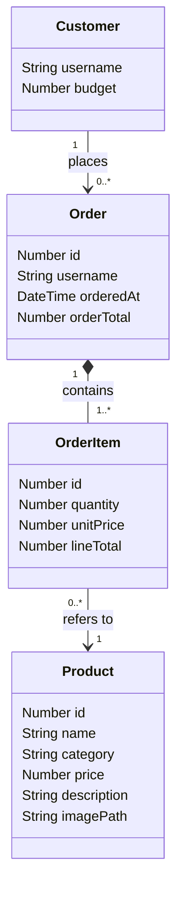

# Architecture — Furniture Shop Buyer App

How the app is built today (R + Shiny), and the plan for rebuilding it in Python to reach
the sleek, photo-led catalogue and cart described in `requirements.md`.

## Stack — today (R + Shiny)

- **R + Shiny** — one language for the whole app, UI and logic together.
- **SQLite**, via `DBI`/`RSQLite` — file-based database, no server to install or run.
- **shinymanager** — login screen and hashed credentials, stored in their own SQLite file,
  separate from shop data.

## Current file structure

| File | Responsibility |
| --- | --- |
| `app.R` | Entry point. Initialises both databases, wraps the UI in shinymanager's login screen, launches the app. |
| `R/ui.R` | What the buyer sees: budget summary, catalogue tab, My Orders tab. |
| `R/server.R` | App logic: reads the logged-in user and budget, builds the catalogue table, handles placing an order, keeps the budget display current. |
| `R/db.R` | Shop database: products and orders. No Shiny dependency, so it's unit-tested directly. |
| `R/auth.R` | shinymanager setup and the demo user accounts. |
| `tests/testthat/test-budget.R` | Tests for `can_afford()` and `place_order()`. |

## Current data model

**`products` table**: `id`, `name`, `category`, `price`, `description`, `colour` (a hex
colour used to draw a swatch — there are no product photos yet).

**`orders` table**: `id`, `username`, `product_id`, `product_name`, `quantity`, `unit_price`,
`order_total`, `ordered_at`. One row per order placed (currently: one product per order).

**Credentials database** (separate SQLite file): username, hashed password, budget, admin
flag — managed entirely by shinymanager, never touched directly by `db.R`.

## Current request/session flow

1. `app.R` creates the `data/` folder if missing, initialises the credentials db and the shop
   db, then wraps `app_ui` in `shinymanager::secure_app()` before starting the app.
2. On login, `secure_server()` returns `res_auth`, which carries the logged-in username and
   their budget — `server.R` reads both from there.
3. `orders_version`, a reactive counter, is bumped after every successful order, which is what
   makes spend and order history re-read from the database without a full page reload.

## Current UI (why it looks like a dashboard)

- A `tabsetPanel` with two tabs: **Catalogue** (a plain HTML table plus a single
  dropdown-and-quantity order form) and **My Orders** (a plain table).
- Products are represented by a coloured square, not a photo.
- One product can be ordered at a time — no multi-select, no cart.
- Everything renders in Shiny's default Bootstrap 3 styling, which is where the "dashboard"
  look comes from.

## Planned redesign — target architecture (Python)

R + Shiny is being replaced for this app. The friction was specific: getting a real photo
card grid, hover states, and a snappy multi-select cart out of Shiny means writing raw
HTML/CSS against the framework's reactive component model rather than with it — see
`requirements.md` for the full reasoning. SQLite stays exactly as it is; only the
application layer changes language.

### Target stack

- **Flask** — Python micro web framework: routes, request handling, sessions.
- **Jinja2** (bundled with Flask) — server-rendered HTML templates.
- **SQLite**, via Python's built-in `sqlite3` — same database file format as today, no new
  dependency.
- **Flask-Login** + `werkzeug.security` (bundled with Flask) — session-based login and
  password hashing. Replaces shinymanager; the two-database separation (shop data vs.
  credentials) carries over.
- Hand-written CSS (`static/style.css`) for the card grid, hover states, and overall look,
  plus a small amount of vanilla JS (`static/cart.js`) so "add to order" feels instant
  rather than a full page reload.

### Target file structure

```
app.py                     # entry point — creates the Flask app, registers routes
templates/
├── base.html              # shared layout: nav, budget bar
├── login.html
├── catalogue.html         # product card grid
├── cart.html              # "Your Order" review/checkout page
└── orders.html            # "My Orders" history
static/
├── style.css              # card grid, hover states, sleek theme
├── cart.js                # add-to-order interactivity
└── images/                # product photos
db.py                      # SQLite access: products, orders, order_items — same job as R/db.R
auth.py                    # login/session handling, password hashing — same job as R/auth.R
tests/
└── test_budget.py         # same tests as test-budget.R, ported to pytest
data/
├── shop.sqlite            # gitignored, regenerated on first run
└── credentials.sqlite     # gitignored, regenerated on first run
```

Same shape as the current R layout, one file per responsibility — only the language changes.

### Data model (target)



This data model doesn't depend on the language, so it carries straight over from the
original plan. Four things the app needs to remember, in plain English:

- **Customer** — a logged-in buyer: their username and their budget ceiling. Their password
  isn't shown here — that's handled by Flask-Login and a separate credentials database, the
  same separation shinymanager provided today.
- **Product** — one catalogue item: name, category, price, description, and (new) a photo.
- **Order** — one submitted "shopping trip": who placed it, when, and its total. This is a
  new concept — today's flat `orders` table has no separate idea of "an order," only
  individual purchase rows.
- **OrderItem** — one product within an order, and how many of it — e.g. "2 × Lund Dining
  Chair" on a particular order. This is what makes multi-product orders possible: one Order
  can have several OrderItems, each pointing at a different Product.

How they connect:

- A **Customer places** any number of **Orders** over time — that's their order history.
- An **Order contains** one or more **OrderItems** — this is what the cart becomes once the
  buyer submits it. An order can't be empty, and an item can't exist without its order
  (shown as the filled diamond).
- Each **OrderItem refers to** exactly one **Product**, but keeps its own `quantity` and
  `unitPrice` rather than looking the price up fresh each time. That's deliberate: if a
  product's catalogue price changes later, past orders shouldn't silently change value.

**Deliberately not modelled: the cart itself.** The cart lives in the Flask session (a
signed cookie holding `{product_id: quantity}`) while a buyer is actively shopping — a
direct equivalent of the session-scoped structure Shiny would have used. It only becomes
real, remembered data — an Order plus its OrderItems — once "Submit order" is pressed. If
it's later decided that carts should survive a logout (see the open question in
`requirements.md`), the cart would need to be persisted server-side instead, and it would
become a fifth entity.

### Catalogue as a card grid

- Each product renders from `catalogue.html` (a Jinja2 loop over the product list): photo,
  name, price, description, an "Add to order" button.
- Cards sit in a CSS grid (`static/style.css`) so they reflow across the page — plain CSS,
  no framework needed.
- Each card's "Add to order" button is its own small HTML form
  (`<form action="/cart/add/{{ product.id }}">`), so there's no id-collision problem to
  solve — unlike the earlier Shiny plan, which needed a module per card for exactly that
  reason.

### Multi-select cart

- `POST /cart/add/<product_id>` adds or increments that product in the session cart.
- `static/cart.js` intercepts the form submit with `fetch()` so the cart count and total
  update immediately, without a full page reload — this is the piece that makes the
  interaction feel instant rather than Shiny's server-round-trip reactivity.

### Cart / checkout page

- `GET /cart` renders `cart.html`: line items (thumbnail, name, quantity, remove button,
  line total), running total, remaining budget.
- `POST /cart/remove/<product_id>` removes a line; `POST /cart/submit` is the one "Submit
  order" action.
- Submitting checks the whole cart against the budget, then writes one `orders` row and its
  `order_items` rows inside a single transaction (`with conn:` in Python's `sqlite3` gives
  the same all-or-nothing guarantee as `dbBegin()`/`dbCommit()`/`dbRollback()` today), then
  clears the session cart.

### Data layer (`db.py`)

- Two tables: `orders` (id, username, ordered_at, order_total) and `order_items` (id,
  order_id, product_id, quantity, unit_price, line_total).
- `can_afford(budget, spent, order_total)` — a direct, line-for-line port of the R function;
  same signature, same logic.
- `place_cart_order(conn, username, cart, budget)` — checks the whole cart against remaining
  budget in one go, then inserts the order and its items in one transaction.

### What doesn't change

- SQLite as the database (the connection library changes; the `.sqlite` file format
  doesn't).
- The budget rule itself (`can_afford()`), and the two-database separation between shop data
  and credentials.
- Demo accounts as the login mechanism (same three buyers, same idea, seeded into the new
  credentials database).
- Testing the business logic (budget rule, order placement) independently of the web
  framework — `pytest` replaces `testthat`, same principle, same test cases.

## Risks / things to know before building

- This is a rebuild, not a port: `shinymanager`, `ui.R`, and `server.R` are replaced rather
  than translated. The data model, the budget rule, and the test cases carry over faithfully
  and quickly — the login and page-rendering layers are new code.
- Flask has no built-in equivalent to shinymanager's one-line `secure_app()` — session
  handling and login need to be wired up by hand (via Flask-Login), which is standard and
  well-documented, but it is new code to write and test today, not a straight translation.
- Without the small JS layer (`cart.js`), every cart action is a normal full-page reload —
  still fully functional, just less "app-like." The JS layer recovers the snappy feel; it's
  a small, optional enhancement on top of a working server-rendered version, so it can be
  added after the core flow works.
- Multi-image or zoom galleries are explicitly out of scope in `requirements.md` — one photo
  per product keeps the image-sourcing problem manageable.
